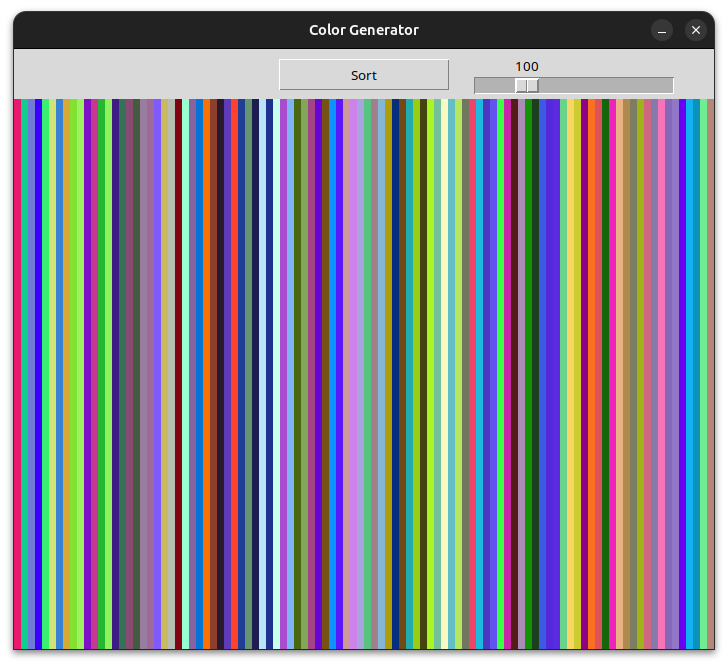
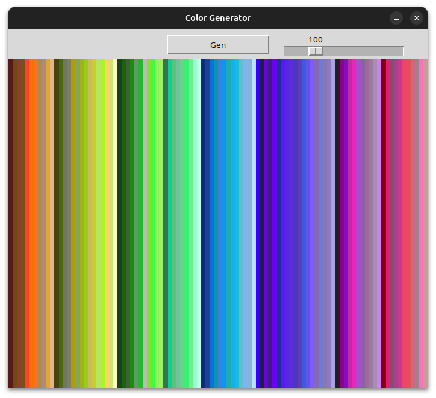

# Color Generator and Sorter

This Python project is a **Color Generator and Sorter** built using `tkinter`. It generates a series of random colors, visualizes them as bars, and allows users to sort them based on hue, brightness, and saturation for a beautiful gradient effect.

## Features

- **Random Color Generation**: Generate a customizable number of random RGB colors.
- **Color Sorting**: Sort colors based on hue, luminance, and value to create visually appealing gradients.
- **Interactive GUI**: A dynamic graphical interface that updates in real-time with options to regenerate or sort colors.
- **Customizable Bar Count**: Adjust the number of displayed colors with a slider.

## Screenshots

<p align="center">
  
  
</p>

## Installation

1. **Clone the Repository**:
   ```bash
   git clone https://github.com/AnisAbdellatif/colorsGenerator-Sorter.git
   cd color-generator
   ```
   
2. **Install Dependencies**:
   Ensure you have Python 3 installed. The tkinter module is included in the standard Python library.

## Running the App

```bash
python color_generator.py
```

## Usage
- **Generate Colors**: Click the Gen button to generate random colors.
- **Sort Colors**: Click the Sort button to sort colors based on their properties.
- **Adjust Bar Count**: Use the slider to customize the number of bars displayed (up to 400).
